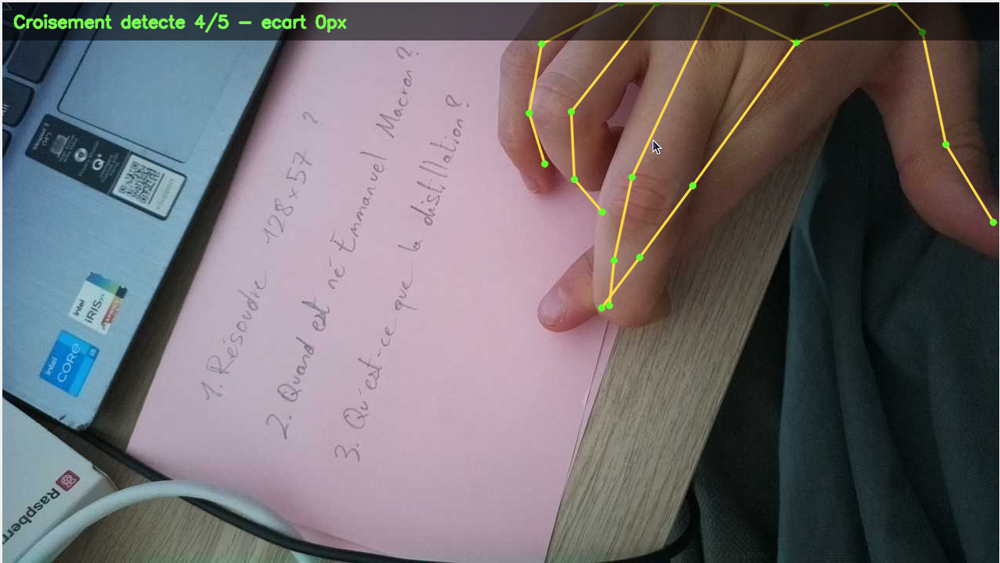
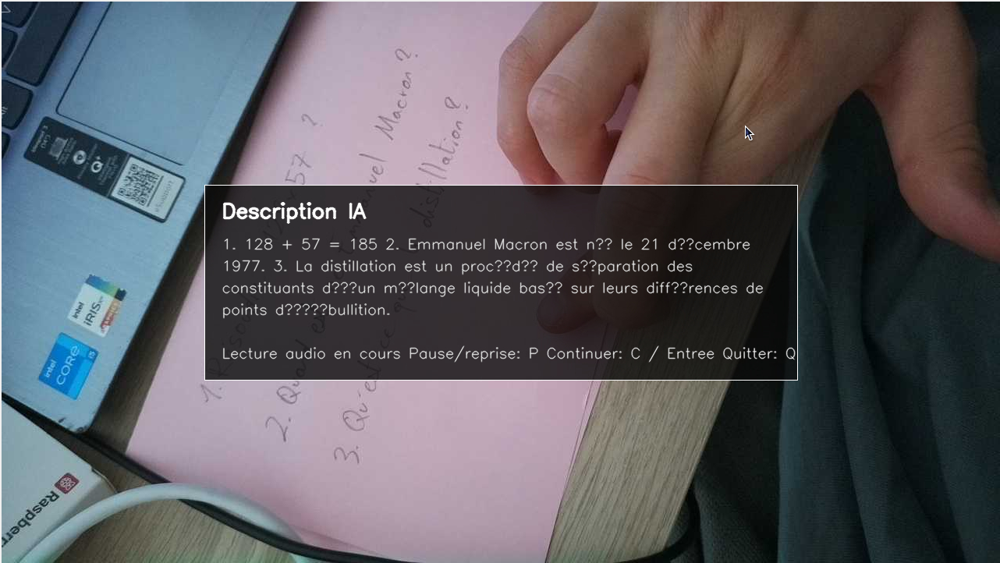

# Atsee Hand Capture

## ⚠️ WARNING: THIS VERSION MAY NOT WORK WITH THE LATEST RASPBERRY PI UPDATES AND WITH NEW RECENT UPDATES ON GITHUB MARKETPLACE APIs⚠️

A small Python app that uses OpenCV + MediaPipe to detect a hand through a webcam.

When the tip of the index finger touches the tip of the middle finger for a few frames, the image is frozen and the app asks:



```text
Would you like to send it?
```

Press `O`, `Y`, or `Enter` to send the image to GitHub Models. Press `N` or `Escape` to return to the camera.

The AI response is displayed in the window and in the terminal, then read aloud using an Edge TTS neural voice.

While the response is being read, press `P` to pause and press `P` again to resume.



## Installation

```bash
python -m venv .venv
source .venv/bin/activate
pip install -r requirements.txt
python main.py
```

Voice playback uses `ffplay` or `mpg123` if available on the system.

## Configuration

The `.env` file can contain either a single raw token or the following variables:

```text
GITHUB_MODELS_TOKEN=github_pat_xxx
GITHUB_MODEL=openai/gpt-4.1
```

Optional variables:

```text
CAMERA_INDEX=0
TOUCH_HOLD_FRAMES=5
MAX_IMAGE_SIDE=1024
JPEG_QUALITY=85
TTS_VOICE=fr-FR-DeniseNeural
TTS_RATE=+0%
HAND_LANDMARKER_MODEL_PATH=models/hand_landmarker.task
HAND_LANDMARKER_MODEL_URL=https://storage.googleapis.com/mediapipe-models/hand_landmarker/hand_landmarker/float16/1/hand_landmarker.task
GITHUB_MODELS_ENDPOINT=https://models.github.ai/inference/chat/completions
GITHUB_MODELS_API_VERSION=2026-03-10
```

The token must have the `models:read` permission.

On the first launch, the official MediaPipe model is downloaded to:

```text
models/hand_landmarker.task
```

## Hand Tracking Source

The hand detection loop follows the OpenCV + MediaPipe approach from this project:

https://github.com/Sousannah/hand-tracking-using-mediapipe
